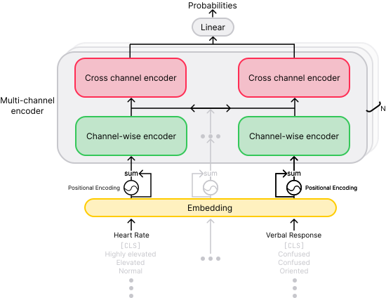

# Transformer Architectures for Multi-Channel Data

<p align="center">

</p>

## :hospital: Getting MIMIC-IV

The MIMIC-IV dataset is available from PhysioNet. You can request access to the
dataset [here](https://physionet.org/content/mimiciv/2.2/).
Note that accessing a dataset requires both a verified PhysioNet account and passing an online course on handling
sensitive data.
Once you have access, you can download the dataset using the following command:

```bash
wget -r -N -c -np --user <your_username> --ask-password https://physionet.org/files/mimiciv/2.2/
```

Note that the download may take a while, due to the slow upload speed of the server, where dataset is stored.
For me it was 4 hours.
See [this](https://github.com/MIT-LCP/mimic-code/issues/600) GitHub discussion.

## :package: Setup

Create a virtual environment and install the required packages:

```bash
python3 -m venv venv
source venv/bin/activate
pip install -r requirements.txt
```

## :hammer: Data Preprocessing

Here are the required steps to build the benchmark.
All the commands are run from the repository root.

1. For each patient we create a directory `data/mimic/<patient_id>/`, where we aggregate and store information about
   their stay `stay.csv`, events `events.csv` and diagnoses `diagnoses.csv`.
   Since aggregation happens from many different tables, this step will take quite some time.
   Path to mimic should be of this form `<dir_where_downloaded>/physionet.org/files/mimiciv/2.2/`.

```bash
python -m src.preprocessing.extract_patients <path_to_mimic> data/mimic/
```

2. The following command attempts to fix some issues (ICU stay ID is missing) and removes the events that have missing
   information.

```bash
python -m src.preprocessing.validate_events data/mimic/
```

3. For each ICU stay of the patient we create a seprate file with events occured during their stay.

```bash
python -m src.preprocessing.episode_extraction data/mimic/
```

5. Create data samples for the in-hospital mortality prediction:

```bash
 python -m src.preprocessing.create_in_hospital_mortality data/mimic/ data/in-hospital-mortality/
```

6. Create data samples for the length of stay prediction:

```bash
python -m src.preprocessing.create_length_of_stay data/mimic/ data/length-of-stay/
```

For reproducibility, we share a listfiles, describing episodes used for training `train_listfile.csv`,
validation `val_listfile.csv` and test `test_listfile.csv`.
Listfiles are stored in `data/in-hospital-mortality/` and `data/length-of-stay/` directories.

## :running: Training

All the models have been trained on three random seeds: `42`, `23456`, and `976`.

After training the best model checkpoint is saved to file `best_<model_type>_<checkpoint>.ckpt` in
the `models/<in_hospital_mortality/length_of_stay>` directory.
You can evaluate the best checkpoint on the test set by passing `--test_checkpoint <path_to_checkpoint>` argument to the
same command you used for training.

Optionally, you can preprocess for each model by the following command:

```bash
python3 -m src.mimic.prepare_data --data <input_data_dir> --output <where_to_write_prepared_files> --max_seq_len <number of hours or -1 for unaggregated> <(--normalize --one_hot) or --discretize>````
```

Then you can pass the prepared data dir to use for training via `--processed_data_dir <path_to_prepared_data>` argument.

### LSTM-based model:

To train model on aggregated or unaggregated time series, pass `--aggregate` or `--padding numerical` argument to the
script.

To train the LSTM-based model for in-hospital mortality prediction with best found parameters, run the following
command:

```bash
python -m src.in_hospital_mortality.train --model lstm --input_dim 48 --embed_dim 16 --num_layers 1 --batch_size 64 --lr 0.001 --dropout 0.3 --output_dim 2 --normalize --one_hot --seed <your_seed> <--aggregate/ --padding numerical>
```

To train the LSTM-based model for length of stay prediction with best found parameters, run the following command:

```bash
python -m src.length_of_stay.train --model lstm --input_dim 48 --embed_dim 64 --num_layers 1 --batch_size 64 --lr 0.001 --dropout 0.3 --output_dim 9 --normalize --one_hot --seed <your_seed> <--aggregate/ --padding numerical>
```

### Simple Transformer:

To train model on aggregated or unaggregated time series, pass `--aggregate` or `--padding categorical` argument to the
script.


```bash
python -m src.in_hospital_mortality.train --model simple_transformer --input_dim 132 --embed_dim 32 --batch_size 64 --lr 0.001 --dropout 0.1 --output_dim 2 --discretize --seed <your_seed> <--aggregate/ --padding categorical>
```

To train the LSTM-based model for length of stay prediction with best found parameters, run the following command:

```bash
python -m src.in_hospital_mortality.train --model simple_transformer --input_dim 132 --embed_dim 32 --batch_size 64 --lr 0.001 --dropout 0.1 --output_dim 9 --discretize --seed <your_seed> <--aggregate/ --padding categorical>
```

### Multichannel Transformer:

To train model on aggregated or unaggregated time series, pass `--aggregate` or `--padding categorical` argument to the
script.


```bash
python -m src.in_hospital_mortality.train --model multi_channel_transformer --input_dim 17 --embed_dim 32 --batch_size 64 --lr 0.00005 --dropout 0.1 --output_dim 2 --discretize --seed <your_seed> <--aggregate/ --padding categorical>
```

To train the LSTM-based model for length of stay prediction with best found parameters, run the following command:

```bash
python -m src.in_hospital_mortality.train --model multi_channel_transformer --input_dim 17  --embed_dim 32 --batch_size 64 --lr 0.00005 --dropout 0.1 --output_dim 9 --discretize --seed <your_seed> <--aggregate/ --padding categorical>
```